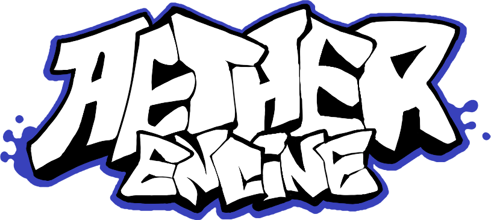

    
    <h1>Aether Engine for Friday Night Funkin'</h1>

    
    
    

## What's Friday Night Funkin?

_Friday Night Funkin'_ is a **rhythm game.** Built using HaxeFlixel for [Ludum Dare 47.](https://ldjam.com/events/ludum-dare/47)

> Uh oh! Your tryin to kiss ur hot girlfriend, but her MEAN and EVIL dad is trying to KILL you! He's an ex-rockstar, the only way to get to his heart? The power of music...

Play the game here:

- [Newgrounds](https://www.newgrounds.com/portal/view/770371)
- [Itch.io](https://ninja-muffin24.itch.io/funkin)
- [Google Play](https://play.google.com/store/apps/details?id=me.funkin.fnf)
- [App Store](https://apps.apple.com/app/id6740428530)

## What's Aether Engine?

_Aether Engine_ is a **non-official modding engine** for Friday Night Funkin'.

Unlike traditional engines like [_Psych Engine_](https://github.com/ShadowMario/FNF-PsychEngine) or [_Kade Engine_](https://github.com/kadedev/kade-engine), Aether Engine is not a fork of Friday Night Funkin's code. Aether Engine is written in C++ without an official game engine like [_HaxeFlixel._](https://haxeflixel.com/)

> This engine is currently a work in progress. Its identity is not fully mature and is subject to change overtime.

### My Ideas for This Engine:

> These features are planned. The engine is early in development, and nothing is final.

- Mods made with Aether Engine will be written purely in [Lua,](https://www.lua.org/) enabled by [Sol3.](https://github.com/ThePhD/sol2) These mods will be distributed as _packages,_ taking a form of a `.aether` archive.
- Aether Engine will aim to modernize modding development by taking an SDK-like approach, making modding an easier process.

## How to Build

> This part of the README is yet to be acknowledged.
